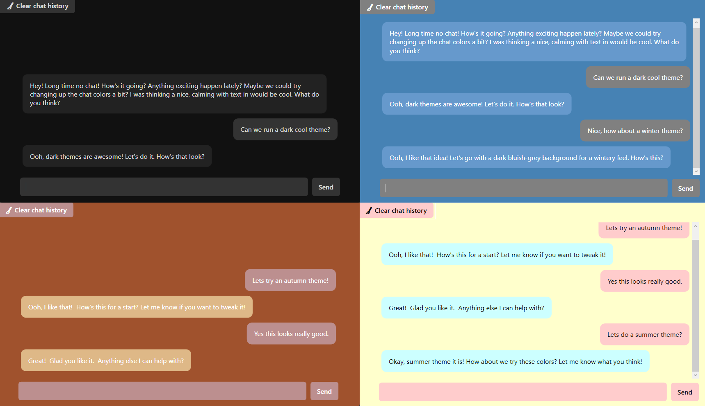

# WinChat, the home of Winnie

**Winnie** is your Windows AI companion 🤖. You and Winnie can interact and perform various functionality both inside and outside the application!

> [!NOTE] 
> This project is a fun, experimental AI chatbot and is not intended for production use. 

## Features
- **Application theme changes 👨‍🎨**: Winnie loves playing around with the application theme and help you specify the colors of the theme. Note that he doesn't always listen and may change the colors whenever he feels like it...
- **Execute windows commands! 🖥️**: Winnie is able to execute any command in the command prompt... Yes this is a bad idea. To help you survive there is a prompt that will ask you if you really want to listen to Winnie (⚠️Warning⚠️ Winnie has been known to try and shut down your PC "for fun")
- **Chat history 📝**: Winnie will remember your recent conversation and a small sample of past conversations. You can always erase Winnie's entire memory with the simple click of a button (Winnie thinks this is cruel.. But he won't remember it 😵).
- **Winnie gets bored 🥱**: If you don't keep Winnie engaged he will sometimes try tp initiate a conversation himself. Or run any command he feels like... Maybe best to keep him occupied.

## Examples

### Winnie plays around with the color themes, sometimes on his own accord 🌈:

### Winnie helps me finding my printers 🖨️

### Winnie tries to execute a "fun windows command" 💀

## Development

### Running migrations

From `Src\WinChat` directory:

`dotnet ef migrations add MigrationName --project ../WinChat.Infrastructure`

`dotnet ef database update`
